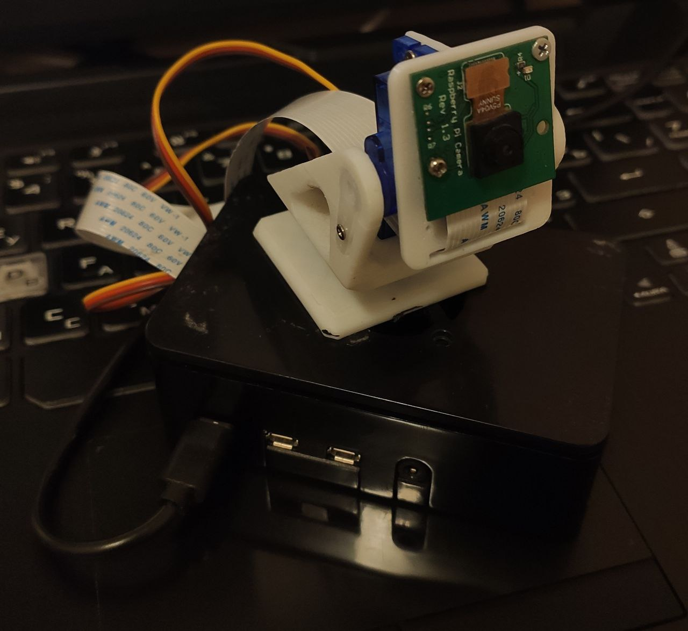
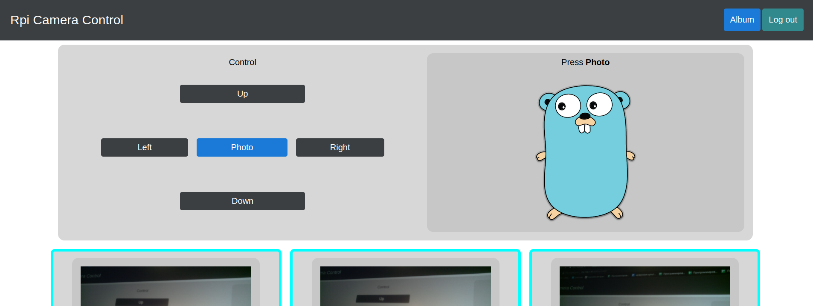

# RaspberryPi camera web controller
## Web interface to control the raspberry pi camera


## Control
Access to the control panel and the album is carried out after authorization. There are buttons on the control panel to control the position of the camera and to take a photo. Immediately after shooting, the new photo is displayed next to the control panel. All photos taken are displayed in the album.


## Settings
The path to the configuration file is declared by the flag  `-configs-path [path]` (default `configs/serverConf.toml`).
```toml
[server_config]
bind_addr = ":8080"                 # web server binding port
log_level = "debug"                 # log level
session_key = "[session_key]"       #

[camera_config]

[servo_config]
gpio_x = 12                         # gpio pin for connecting a servo to move the camera along the x-axis
gpio_y = 19                         # gpio pin for connecting a servo to move the camera along the y-axis
inverse_x = true                    # servo-x direction inversion
inverse_y = false                   # servo-y direction inversion

[user_store]
auth_file = "users.json"            # file where logins and encrypted passwords are stored during restart
new_user_key = "[new_user_key]"     # passcode to enter when registering a new user 
```
## Camera mount
You can download my model for attaching a standard camera to the SG90 servo drive [here](https://www.thingiverse.com/thing:4710301).
